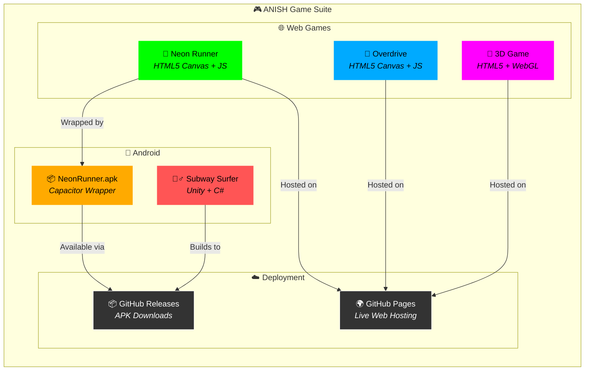
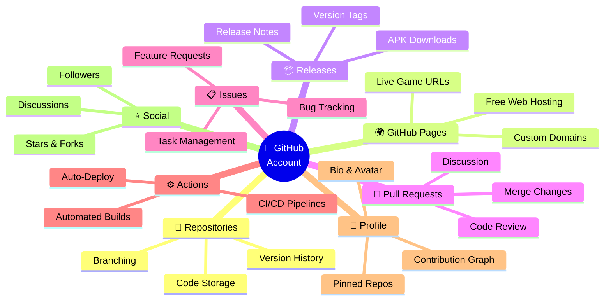
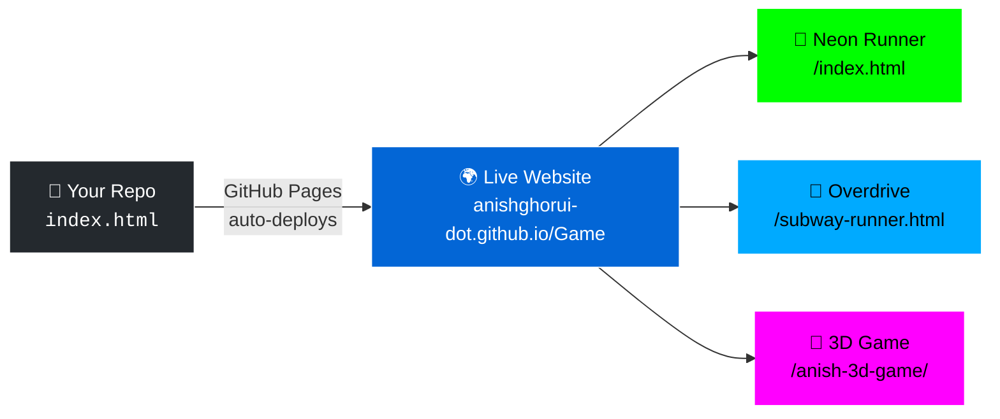
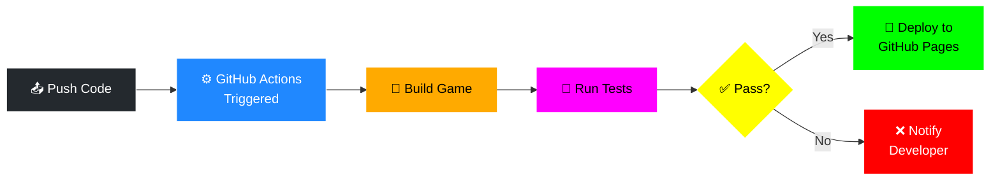
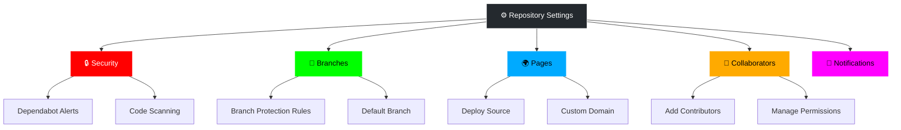
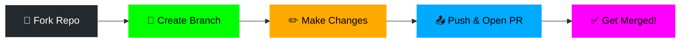

# 🎮 ANISH Game Suite

[](https://github.com/anishghorui-dot/Game/stargazers)
[](https://github.com/anishghorui-dot/Game/network/members)
[](https://github.com/anishghorui-dot/Game/issues)
[](https://github.com/anishghorui-dot/Game)
[](https://github.com/anishghorui-dot/Game/commits)
[](https://github.com/anishghorui-dot/Game)

> **A multi-platform game collection by ANISH** — featuring arcade shooters, endless runners, and 3D games built with Unity, JavaScript, and HTML5 Canvas.

---

## 📑 Table of Contents

| Section | Description |
|---------|-------------|
| [🕹️ Games Overview](#️-games-overview) | All games at a glance |
| [🏗️ Project Architecture](#️-project-architecture) | Visual system diagram |
| [🛠️ Tech Stack](#️-tech-stack) | Technologies used |
| [📂 Repository Structure](#-repository-structure) | File & folder layout |
| [🚀 Quick Start](#-quick-start) | How to play immediately |
| [🐙 GitHub Features Guide](#-github-features-guide) | Visual guide to GitHub features used |
| [🤝 Contributing](#-contributing) | How to help improve |

---

## 🕹️ Games Overview

| | Game | Type | Platform | Play Now |
|---|------|------|----------|----------|
| 🔫 | **Neon Runner** | Arcade Shooter | 🌐 Web / 📱 Android | [▶️ Play in Browser](https://anishghorui-dot.github.io/Game/index.html) |
| 🏃 | **Overdrive** | Endless Runner | 🌐 Web / 📱 Mobile | [▶️ Play in Browser](https://anishghorui-dot.github.io/Game/subway-runner.html) |
| 🏃‍♂️ | **ANISH Subway Surfer** | Endless Runner | 📱 Android (Unity) | [📥 See Setup Guide](AnishSubwaySurfer/README.md) |
| 🎲 | **Anish 3D Game** | 3D Action | 🌐 Web | [▶️ Play in Browser](https://anishghorui-dot.github.io/Game/anish-3d-game/index.html) |

### 🔫 Neon Runner — Arcade Shooter

```
🎯 10 Power-ups    👾 4 Enemy Types    💥 Combo System    ⚡ 360° Special Attack
```

| Feature | Details |
|---------|---------|
| 🎮 Controls | WASD / Arrow Keys to move, Space to shoot, Q for special |
| 📱 Mobile | Virtual joystick + 4 action buttons |
| 🏆 Scoring | Combos + ANISH letters = 500 bonus |
| 📦 APK | [Download NeonRunner.apk](NeonRunner.apk) (3.9 MB) |

### 🏃 Overdrive — Endless Runner

```
🛣️ 3-Lane System    🪙 Coin Collection    🧲 Power-ups    📱 Swipe Controls
```

| Feature | Details |
|---------|---------|
| 🎮 Controls | Swipe left/right to change lanes |
| ⬆️ Actions | Swipe up to jump, down to slide |
| 🛡️ Power-ups | Magnet, Shield, Speed Boost, Double Coins |
| 🏆 Goal | Spell A-N-I-S-H for 500 bonus coins |

---

## 🏗️ Project Architecture



---

## 🛠️ Tech Stack

| Category | Technology | Usage |
|----------|-----------|-------|
| 🎮 Game Engine |  | Subway Surfer clone |
| 💻 Languages |     | Game logic & UI |
| 📱 Mobile |   | Native Android apps |
| 🏗️ Build |   | Build system |
| ☁️ Hosting |  | Live web deployment |

---

## 📂 Repository Structure

```
📁 Game/
│
├── 🌐 index.html                  ← Neon Runner (web game)
├── 🌐 subway-runner.html          ← Overdrive (web game)
├── 📦 NeonRunner.apk              ← Android app (ready to install)
├── 🎵 Anish game.mp3              ← Game audio
├── 📄 README.md                   ← You are here!
├── 📄 ANDROID_APK_README.md       ← APK install guide
├── ⚙️ package.json                ← Node.js dependencies
├── ⚙️ capacitor.config.json       ← Capacitor config
│
├── 📁 AnishSubwaySurfer/          ← Unity project
│   ├── 📄 README.md               ← Unity setup guide
│   └── 📁 Assets/Scripts/
│       ├── 🎮 PlayerController.cs  ← Movement & input
│       ├── 🏆 GameManager.cs       ← Scoring & UI
│       ├── 🌍 EnvironmentGenerator.cs ← World generation
│       ├── 📷 CameraFollow.cs      ← Camera system
│       ├── ✉️ LetterCollectible.cs  ← A-N-I-S-H letters
│       └── ⚡ PowerUp.cs           ← Power-up effects
│
├── 📁 anish-3d-game/              ← 3D web game
│   └── 🌐 index.html
│
├── 📁 android/                    ← Native Android project
│   ├── 📁 app/                    ← App source code
│   └── 📁 gradle/                 ← Build configuration
│
└── 📁 www/                        ← Web root (Capacitor)
    └── 🌐 index.html
```

---

## 🚀 Quick Start

### ▶️ Play Instantly in Your Browser

> No installation needed — just click and play!

| Game | Link |
|------|------|
| 🔫 Neon Runner | 👉 [**anishghorui-dot.github.io/Game/index.html**](https://anishghorui-dot.github.io/Game/index.html) |
| 🏃 Overdrive | 👉 [**anishghorui-dot.github.io/Game/subway-runner.html**](https://anishghorui-dot.github.io/Game/subway-runner.html) |
| 🎲 3D Game | 👉 [**anishghorui-dot.github.io/Game/anish-3d-game/**](https://anishghorui-dot.github.io/Game/anish-3d-game/index.html) |

### 📱 Install on Android

```
1.  📥  Download NeonRunner.apk from this repo
2.  📲  Transfer to your Android phone
3.  ✅  Allow "Install from Unknown Sources"
4.  🎮  Open "Neon Runner" and play!
```

### 🖥️ Run Locally

```bash
# Clone the repository
git clone https://github.com/anishghorui-dot/Game.git

# Open any HTML game in your browser
open Game/index.html           # Neon Runner
open Game/subway-runner.html   # Overdrive
```

---

## 🐙 GitHub Features Guide

> **A visual guide to every GitHub feature used in this project** — learn how GitHub powers your development workflow!

### 🗺️ Feature Map



---

### 📁 Feature 1: Repository — Your Project's Home

> **What it is:** A repository (repo) is where all your project files, history, and collaboration happen.

```
┌─────────────────────────────────────────────────────────┐
│  📁 anishghorui-dot/Game                                │
│  ─────────────────────────────────────────────────────  │
│                                                         │
│  📄 Code    📋 Issues    🔀 Pull Requests    ⚙️ Actions  │
│                                                         │
│  ┌─────────────────────────────────────────────────┐    │
│  │  📁 AnishSubwaySurfer/    ← Unity game files    │    │
│  │  📁 android/              ← Android project     │    │
│  │  📁 www/                  ← Web deployment      │    │
│  │  📄 index.html            ← Neon Runner game    │    │
│  │  📦 NeonRunner.apk        ← Android app         │    │
│  │  📄 README.md             ← This file!          │    │
│  └─────────────────────────────────────────────────┘    │
│                                                         │
│  ⭐ Star  🍴 Fork  👁️ Watch  📥 Clone                   │
└─────────────────────────────────────────────────────────┘
```

| Action | What It Does | How to Use It |
|--------|-------------|---------------|
| ⭐ **Star** | Bookmark this repo & show support | Click "Star" at the top of the repo page |
| 🍴 **Fork** | Create your own copy to modify | Click "Fork" → makes a copy under your account |
| 👁️ **Watch** | Get notified of all activity | Click "Watch" → choose notification level |
| 📥 **Clone** | Download code to your computer | `git clone https://github.com/anishghorui-dot/Game.git` |

---

### 🌍 Feature 2: GitHub Pages — Free Website Hosting

> **What it is:** GitHub Pages turns your repo into a live website — perfect for hosting web games!



| Setting | Value | Where to Find |
|---------|-------|---------------|
| 📍 Source | `main` branch, root `/` | Repo → Settings → Pages |
| 🔗 URL | `https://anishghorui-dot.github.io/Game/` | Auto-generated |
| 💰 Cost | **Free!** | Included with GitHub account |

**How to enable:**
1. Go to your repo → **Settings** tab
2. Scroll to **Pages** section (left sidebar)
3. Under **Source**, select `main` branch
4. Click **Save** → Your site goes live! 🎉

---

### 📋 Feature 3: Issues — Track Bugs & Ideas

> **What it is:** Issues are how you track bugs, request features, and manage tasks.

```
┌──────────────────────────────────────────────────────┐
│  📋 Issues                                [New Issue] │
│  ────────────────────────────────────────────────────│
│                                                      │
│  🔴 #3  Game crashes on older Android phones         │
│         Labels: 🐛 bug  📱 android                   │
│                                                      │
│  🟢 #2  Add multiplayer support           [CLOSED]   │
│         Labels: ✨ enhancement                       │
│                                                      │
│  🟢 #1  Add sound effects to Neon Runner  [CLOSED]   │
│         Labels: ✨ enhancement  🔊 audio             │
│                                                      │
└──────────────────────────────────────────────────────┘
```

| Label Type | Purpose | Color |
|------------|---------|-------|
| 🐛 `bug` | Something is broken | 🔴 Red |
| ✨ `enhancement` | New feature request | 🔵 Blue |
| 📝 `documentation` | Docs need updating | 🟡 Yellow |
| ❓ `question` | Need help/clarification | 🟣 Purple |
| 🔧 `good first issue` | Easy for newcomers | 🟢 Green |

---

### 🔀 Feature 4: Pull Requests — Collaborate on Changes

> **What it is:** Pull Requests (PRs) let you propose changes, get reviews, and merge code safely.

```mermaid
gitgraph
    commit id: "Initial game"
    commit id: "Add Neon Runner"
    branch feature/new-powerup
    commit id: "Add laser powerup"
    commit id: "Add tests"
    checkout main
    merge feature/new-powerup id: "Merge PR #1" type: HIGHLIGHT
    commit id: "Release v1.1"
```

**PR Workflow:**
```
1.  🌿  Create a branch     →  git checkout -b my-feature
2.  ✏️  Make your changes    →  Edit code, add files
3.  📤  Push to GitHub       →  git push origin my-feature
4.  🔀  Open a Pull Request  →  Click "New Pull Request" on GitHub
5.  👀  Get code review      →  Team reviews your changes
6.  ✅  Merge when approved  →  Click "Merge Pull Request"
```

---

### ⚙️ Feature 5: GitHub Actions — Automate Everything

> **What it is:** Actions automate tasks like building, testing, and deploying your code on every push.



| Concept | Description |
|---------|-------------|
| **Workflow** | A YAML file that defines automation steps |
| **Trigger** | Event that starts the workflow (push, PR, schedule) |
| **Job** | A set of steps that run on a virtual machine |
| **Step** | Individual command or action within a job |

---

### 📦 Feature 6: Releases — Distribute Your App

> **What it is:** Releases let you package and distribute versioned downloads of your app (like APKs).

```
┌─────────────────────────────────────────────────────┐
│  📦 Releases                                        │
│  ──────────────────────────────────────────────────  │
│                                                     │
│  🏷️ v1.0.0 — Neon Runner Launch 🚀                  │
│  ───────────────────────────────                    │
│  📅 Released on March 2026                          │
│                                                     │
│  📋 What's New:                                     │
│  • 🔫 10 power-ups                                  │
│  • 👾 4 enemy types                                  │
│  • 📱 Android APK included                          │
│                                                     │
│  📎 Assets:                                         │
│  ┌──────────────────────────────────────┐           │
│  │  📱 NeonRunner.apk        3.9 MB    │           │
│  │  📦 Source code (zip)     1.2 MB    │           │
│  │  📦 Source code (tar.gz)  1.1 MB    │           │
│  └──────────────────────────────────────┘           │
└─────────────────────────────────────────────────────┘
```

**How to create a release:**
1. Go to your repo → **Releases** (right sidebar)
2. Click **"Draft a new release"**
3. Create a tag (e.g., `v1.0.0`)
4. Add a title and description
5. Attach files (like your APK)
6. Click **"Publish release"** 🎉

---

### 👤 Feature 7: Your GitHub Profile

> **What it is:** Your profile showcases who you are, what you build, and your contribution history.

```
┌─────────────────────────────────────────────────────┐
│                                                     │
│  👤 anishghorui-dot                                  │
│  ──────────────                                     │
│  🎮 Game Developer | 🌐 Web Dev | 📱 Android Dev   │
│                                                     │
│  📊 Contribution Graph:                             │
│  ┌─────────────────────────────────────────────┐    │
│  │ ░░▓▓░░▓▓▓▓░░░░▓▓░░▓▓▓▓▓▓░░▓▓▓▓░░▓▓▓▓▓▓░░ │    │
│  │ ░░░▓▓▓░░░▓▓░░▓▓▓▓░░░░▓▓▓▓░░░▓▓▓▓░░░▓▓▓▓░ │    │
│  │ ▓▓░░░▓▓▓▓░░▓▓░░░░▓▓▓▓░░░░▓▓▓░░░▓▓▓▓░░░▓▓ │    │
│  └─────────────────────────────────────────────┘    │
│  Each ▓ = a day you committed code!                 │
│                                                     │
│  📌 Pinned Repositories:                            │
│  ┌──────────────┐  ┌──────────────┐                 │
│  │ 🎮 Game       │  │ 📁 Other Repo │                │
│  │ ⭐ 5  🍴 2   │  │ ⭐ 3  🍴 1   │                │
│  └──────────────┘  └──────────────┘                 │
│                                                     │
└─────────────────────────────────────────────────────┘
```

**Profile Tips:**
| Action | Benefit |
|--------|---------|
| 📝 Add a bio | Tell the world who you are |
| 📌 Pin repos | Showcase your best projects |
| 🟢 Stay active | Green contribution squares show consistency |
| 📄 Profile README | Create a `anishghorui-dot/anishghorui-dot` repo for a custom profile |

---

### 🔍 Feature 8: Code Search & Navigation

> **What it is:** GitHub lets you search code, files, and symbols across your repositories.

| Shortcut | Action |
|----------|--------|
| `t` | Open file finder in any repo |
| `l` | Jump to a specific line number |
| `.` | Open repo in VS Code (web editor) |
| `/` | Focus the search bar |
| `?` | Show all keyboard shortcuts |

**Search Examples:**
```
language:csharp PlayerController    → Find C# files with PlayerController
repo:anishghorui-dot/Game powerup   → Search for "powerup" in this repo
extension:html game                 → Find HTML files containing "game"
```

---

### 🔒 Feature 9: Settings & Security

> **What it is:** Repository settings control access, features, and security for your project.



---

## 🐙 GitHub Account Features at a Glance

| Feature | Icon | What You Get | Status in This Repo |
|---------|------|-------------|-------------------|
| **Repositories** | 📁 | Store and version your code | ✅ Active |
| **GitHub Pages** | 🌍 | Free website hosting | ✅ Games are live! |
| **Issues** | 📋 | Bug tracking & feature requests | ✅ Available |
| **Pull Requests** | 🔀 | Code review & collaboration | ✅ Available |
| **Actions** | ⚙️ | CI/CD automation | 🔜 Can be added |
| **Releases** | 📦 | Distribute downloads (APKs) | 🔜 Can be added |
| **Projects** | 📊 | Kanban-style task boards | 🔜 Can be added |
| **Discussions** | 💬 | Community Q&A forum | 🔜 Can be enabled |
| **Wiki** | 📖 | Documentation pages | 🔜 Can be enabled |
| **Security** | 🔒 | Vulnerability scanning | ✅ Auto-enabled |
| **Insights** | 📈 | Traffic & contributor analytics | ✅ Available |
| **Codespaces** | ☁️ | Cloud development environment | ✅ Available |

---

## 🤝 Contributing

Contributions are welcome! Here's how to get started:



1. **Fork** this repository
2. **Create** a feature branch: `git checkout -b feature/awesome-thing`
3. **Commit** your changes: `git commit -m "Add awesome thing"`
4. **Push** to GitHub: `git push origin feature/awesome-thing`
5. **Open** a Pull Request

---

<div align="center">

### ⭐ If you enjoyed these games, give this repo a star!

**Made with ❤️ by ANISH**

[](https://github.com/anishghorui-dot)

</div>
